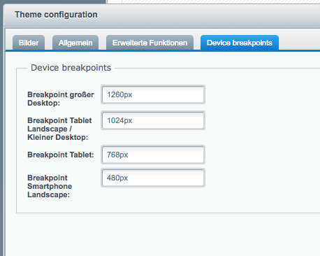

## Theme Configuration

Shopware's Theme system supports shipping Themes that allow a fair amount of configuration.
Shopware's own default theme makes good use of that, you are able to define your shop's logo and colours there,
as well as the behaviour of a number of recurring components. By default, a similar amount of configuration
is available in the Bootstrap Theme. You may choose to enable or disable any configuration option
in your custom theme's `Theme.php`. How, you may ask? This guide will tell you.

### Theme.php

As stated on a previous page, the `Theme.php` contains some elementary configuration - Shopware provides a number
of different configuration fields; their values are then available in your Less and Smarty template files.
Have a look into the `BootstrapBare`'s `Theme.php` file. The first thing you may notice is the vast number of lines
due to an equally impressive amount of configuration options. The second thing you may notice is that most of the
configuration options are hidden.

What's the reason behind this? It's simple. The Shopware Bootstrap Theme is not targeted to shop owners
who would like to perform major changes in a graphical interface; Shopware's own Responsive serves this target group well enough.
Instead, it is supposed to be flexible to developers who like to create and sell themes based on the Bootstrap Theme,
and depending on your ideas you have for your theme, you might want to change the behaviour of some elementary parts.

At first, all this might be overwhelming, but we made an effort to arrange the available configuration options in groups,
which are in turn wrapped in functions.

The following section shows you how to change the default values for some configurations, their appearance in the Theme Manager,
and add your own configuration fields for the end user to configure.

#### Modifying Existing Configuration

The `Theme` class in your `Theme.php` may override the function `createConfig`, which is being invoked with a `TabContainer`.
If you extend a theme and the `inheritanceConfig` attribute is set to _true_, which it is by default, this `TabContainer` is already filled with
the parent theme's configuration.

**Theme.php**
```php
<?php
namespace Shopware\Themes\CustomConfigurationTheme;

use Shopware\Components\Form;

class Theme extends \Shopware\Components\Theme
{
    protected $extend = 'BootstrapBare';

    /* more variables for meta-information */

    protected $inheritanceConfig = true; // true by default, may be omitted

    public function createConfig(Form\Container\TabContainer $container)
    {
        // $container contains BootstrapBare's configuration
    }
}
```

Suppose we want to change the device break-points. These are defined in the `createBreakpointsFieldset`-function
in the Bootstrap Theme's `Theme.php` located in the `general`-Tab, in the `extendedThemeConfigs` field set 
and named `swf-screen-lg-min`, `swf-screen-md-min`, `swf-screen-hd-min` and `swf-screen-sm-min`.

We want to show these configurations in a new tab called “Device breakpoints”.

Let's start with the tab. We will construct a helper function that generates our new tab:

**Theme.php**
```php
<?php
namespace Shopware\Themes\CustomConfigurationTheme;

use Shopware\Components\Form;

class Theme extends \Shopware\Components\Theme
{
    // ...

    /** @var  Form\Container\Tab */
    private $deviceBreakpointTab;

    /** @var  Form\Container\FieldSet */
    private $deviceBreakpointFieldSet;
    
    private function createFieldSets(Form\Container\TabContainer $container)
    {
        $this->deviceBreakpointTab = $this->createTab('deviceBreakpoints', 'Device breakpoints', ['attributes' => [
            'layout' => 'anchor',
            'autoScroll' => true,
        ]]);
        $container->addTab($this->deviceBreakpointTab);

        $this->deviceBreakpointFieldSet = $this->createFieldSet('deviceBreakpoints', 'Device breakpoints');
        $this->deviceBreakpointTab->addElement($this->deviceBreakpointFieldSet);
    }

    public function createConfig(Form\Container\TabContainer $container)
    {
        $this->createFieldSets($container);
    }
}
```

The code is pretty self explanatory: In our `createConfig`-form, we call our helper function, in which we create a new tab
with a single field-set. Both the tab and field set are assigned to private attributes of the `Theme` class.

Now, we are going to search for the fields that we want to move into our newly established field set.
To do that, the only option is to cycle through all tabs, then through all field sets once we are in the right tab,
and finally through all fields once we are in the right field set. Let's bring it on!

**Theme.php**
```php
<?php
// ...
public function createConfig(Form\Container\TabContainer $container)
{
    $this->createFieldSets($container);

    /** @var Form\Container\Tab $tab */
    foreach ($container->getElements() as $tab) {
        switch ($tab->getName()) {
            case 'general':
                $this->modifyGeneralTab($tab);
                break;
        }
    }
}

private function modifyGeneralTab(Form\Container\Tab $tab)
{
    /** @var Form\Container\FieldSet $fieldSet */
    foreach ($tab->getElements() as $fieldSet) {
        switch ($fieldSet->getName()) {
            case 'extendedThemeConfigs':
                $this->modifyExtendedThemeConfigs($fieldSet);
                break;
        }
    }
}

private function modifyExtendedThemeConfigs(Form\Container\FieldSet $fieldSet)
{
    /** @var Form\Field $field */
    foreach ($fieldSet->getElements() as $field) {
        switch ($field->getName()) {
            case 'swf-screen-lg-min':
            case 'swf-screen-md-min':
            case 'swf-screen-hd-min':
            case 'swf-screen-sm-min':
                // Here we can do our modifications with $field
                break;
        }
    }
}
// ...
```

Now that we finally have the correct fields, we can apply our modifications to them. These are:
- Un-hide the field
- Remove it from the current field set
- Add it to our new field set

For the first task, we are going to create another helper function, that removes the `xtype` attribute from the fields.
The `xtype` is currently set to `'hiddenfield'`, therefore ExtJs, the framework used in Shopware's backend, hides the field
from the field set it is located in.

**Theme.php**
```php
<?php
// ...
private function unHideField(Form\Field $field)
{
    $attributes = $field->getAttributes();
    unset($attributes['xtype']);
    $field->setAttributes($attributes);
}
// ...
```

For the other two tasks, we don't need any helpers, because these operations are natively supported by the Collections
in which the field sets store their fields.

Our full `modifyExtendedThemeConfigs` function therefore looks like this:

```php
<?php
// ...
private function modifyExtendedThemeConfigs(Form\Container\FieldSet $fieldSet)
{
    /** @var Form\Field $field */
    foreach ($fieldSet->getElements() as $field) {
        switch ($field->getName()) {
            case 'swf-screen-lg-min':
            case 'swf-screen-md-min':
            case 'swf-screen-hd-min':
            case 'swf-screen-sm-min':
                $this->unHideField($field);
                $fieldSet->getElements()->remove($field);               // remove it from current field set
                $this->deviceBreakpointFieldSet->addElement($field);    // add it to new field set
                break;
            // ...
        }
    }
}
// ...
```

And the result:



[This example is available for download in a separate project on GitHub](https://github.com/conexco/shopware-bootstrap-custom-configuration-theme){:target="_blank"}
